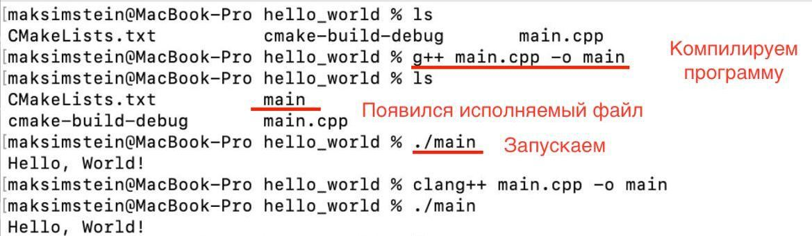
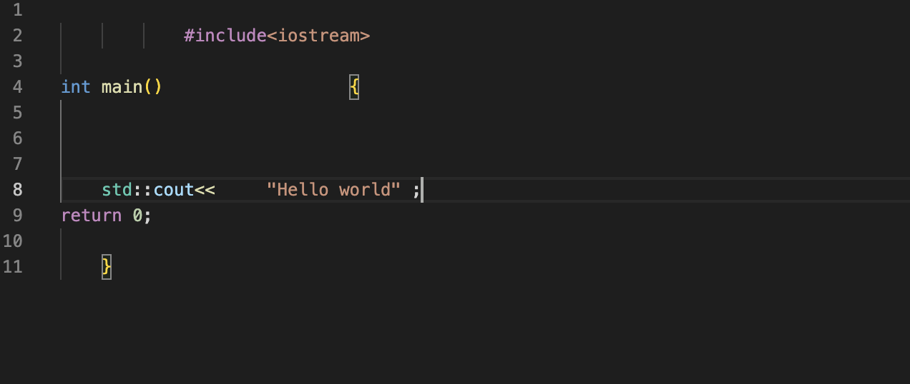
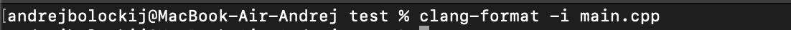
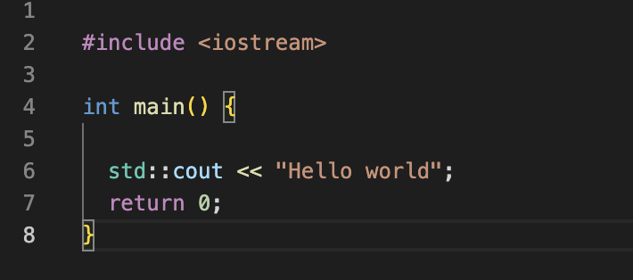
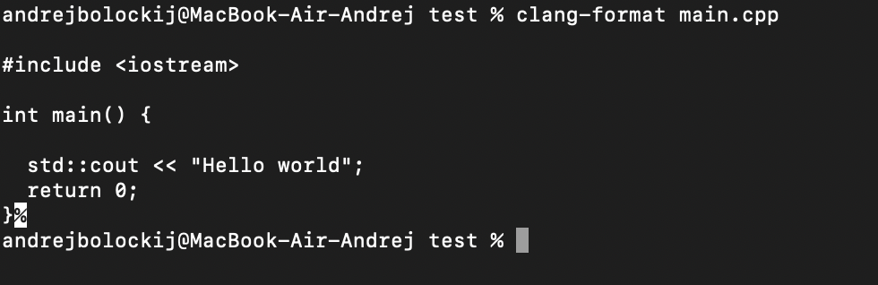

# Гайд по написанию лабораторных работ 
> ревизия от 01.09.2023

## Содержание
1. Введение (личная репа с лабами, цикл отправки лаб {пулл реквест, тесты, код ревью, исправления}, ссылка на CSC Wiki)
1. Инструкция по сдаче лабораторных работ (пока предполагается, что окружение уже настроено)
    1. TODO: Начало работы (как скачать zip папочку, куда писать код, всякие запреты и условия)
    1. Локальное тестирование
        1. Компиляция (какие флаги, требование zero-warning под *всеми* компиляторами)
        1. TODO: cppcheck
        1. TODO: clang-tidy
        1. clang-format
        1. TODO: Открытые тесты
        1. если все предыдущие пункты норм -- переходим к следующему
    1. Как загрузить лабу
        1. В какую ветку загружать
        1. Какие кнопочки нажимать, чтобы загрузить
        1. Требования к Pull Request (из какой ветки в какую, автопроверки на сервере, требования к названию PR, аппрув от бота)
        1. 
    1. Общие советы
1. TODO: Частозадаваемые вопросы
    1. Кому писать если:
        1. не получается подступиться к домашке
        1. что-то отвалилось (склоненный репозиторий, не работают анализаторы\компиляторы)
        1. есть вопросы по языку или по стилю кода
        1. не уверен, что загрузил работу корректно 
    1. Что делать, если запушил не туда? (в main в частности)
    1. ...? 
1. Материалы (ссылки на чаты, людей; ссылки на доки гитхаба; хабр статьи; что угодно, что имеет отношение к лабам и плюсам)

---


## Введение
В течение годового курса по C++ вам предстоит делать лабораторные работы на отработку пройденного на лекциях материала. Получать и сдавать домашние задания вы будете через Github.

### Про честность в домашках
Есть флудилка в Telegram. Там нет важных объявлений, но есть обсуждения про курс с преподавателями и вашими коллегами. Не добавляйте туда никого кроме.
Основное: весь код должен быть написан исключительно вами самостоятельно, но обсуждать теорию можно.

Запрещается привлекать кого угодно для помощи с домашками, кроме лектора, практиков и проверяющих (за исключением ситуаций ниже). Репетиторов тоже нельзя — лучше попросить дополнительную пару, это норм.

Запрещается публиковать или передавать за пределы вашего курса (или более старших курсов нашей программы) и условия, и решения задач. Если вам хочется что-то указать в резюме — вы можете кратко описать задание и свои успехи текстом или выложить кусочек кода (не целиком!) в приватный https://gist.github.com, получить рандомную негуглящуюся ссылку, а потом удалить. Пожалуйста, уважайте труд преподавателей: на разработку первой версии одного домашнего задания легко может уйти полная рабочая неделя в сорок часов, после чего задание каждый год улучшается в деталях.

__Нарушения караются__. Как минимум у всех участников (включая давшего списать, даже если случайно) полностью зануляется соответствующее задание. Сверх этого — по ситуации.

### Про вопросы
__Можно и нужно__ обсуждать друг с другом, преподавателями и кем угодно:
- Содержимое лекций
- Не связанные с домашкой куски кода, вроде "нет ли UB в этой программе?" или "за сколько работает vector::push_back в каких случаях?"
- Настройку среды разработки, запуск компиляторов, отладчиков, и анализаторов
- Вопросы на StackOverflow
- Чисто алгоритмическую часть заданий по C++, вообще не зависящую от языка программирования, вроде "какую структуру данных надо использовать, чтобы работало за линию вместо квадрата"

__Следует__ спрашивать напрямую у своего практика (лектора, проверяющего — если практик недоступен), чтобы получить надёжную информацию:
- Вопросы по условию
- Подсказки

__Не рекомендуется__ обсуждать ни с кем, кроме лектора, практиков или проверяющих:
- Проблемы в своём конкретном коде. Например, скриншот решения во флудилке можно списать, и случайно получить эквивалентное решение
- Детали реализации алгоритмов, вроде "как лучше назвать эту переменную" или "какой инвариант тут лучше сделать"

### Цикл сдачи лабораторных работ
У каждого из вас есть личный репозиторий ‘labs-<github-username>’, работать Вы будете исключительно с ним. Для каждой выданной лабораторной работы в нём есть отдельная ветка (например, lab00-entry), в которую вы загружаете Ваше решение. По мере выдачи новых домашек в вашем личном репозитории будут появляться новые ветки.

Сдача домашнего задания происходит итеративно (в среднем 2-3 итерации), цикл выглядит следующим образом:
- написание и локальное тестирование Вашего решения
- корректное оформление Pull Request с прохождением всех открытых автопроверок и "ОК" от бота
- проверяющий делает код-ревью Вашего Pull Request'а, выставляет баллы за стиль и корректность
- внимательное чтение замечаний и осознание того, что нужно исправить

## Инструкция по сдаче лабораторных работ
__ВАЖНО__: прочитайте гайд полностью перед тем как загружать домашнее задание.
### Начало работы
 !!TODO!! В следующей ревизии
## Локальное тестирование
### Компиляция
#### Локальная компиляция UNIX

Перед прочтением этой главы у вас должны быть установлены хотя бы два компилятора.

Чтобы проверить, что всё установлено нормально запустите:

* `g++ --version` или `g++-13 –version` - чтобы проверить g++

* `clang++ -v` или `clang++-15 -v` - чтобы проверить clang++
  *если версии без суффикса одинаковые, можно его не приписывать*

#### Компиляция из консоли
##### gcc
Чтобы скомпилировать программу из консоли с gcc нужно написать
`g++-13 path/to/source.cpp -o path/to/output_executable` часть `-o path/to/output_executable` - опциональна, если её не добавлять, скомпилированный файл будет называться `a.out` и будет лежать в директории из которой была вызвана команда.

Чтобы скомпилировать программы с обычными проверками компилятора нужно написать `g++-13 path/to/source.cpp -Wall -o path/to/output_executable`

Чтобы скомпилировать программу с определённой версией c++, нужно написать
`g++-13 path/to/source.cpp -std=c++98|c++11|c++14|c++17|c++20 -o path/to/output_executable` - с выбранной версией
 
Небольшой пример как компилировать код из консоли:



#### clang
Меняем `g++-13` на `clang++-15`, остальное пишем так же.


### Работа в среде
В качестве среды рекомендуем установить vs Code с расширениями:
* twxs.cmake - чтобы былы подсказки в cmake
* ms-vscode.cmake-tools - чтобы запускать всё одной кнопкой
* mjohns.clang-format - чтобы быстро форматировать код
* llvm-vs-code-extensions.vscode-clangd - чтобы была хороша подсветка синтаксиса
* yzhang.markdown-all-in-one - чтобы приятно читать и писать markdown

И чтобы проверить, что всё поставилось, создайте рядом с `main.cpp` файл `CMakeLists.txt` и скопируйте в него:
```cmake
cmake_minimum_required(VERSION 3.25)
project(<paste your project name here>)


set(CMAKE_CXX_STANDARD 17)


add_executable(main main.cpp)
```
Теперь среда должна предложить вам собрать и запустить *.cpp файл.


### clang-format
Для успешного прохождения тестов для лабораторных работ
необходимо чтобы код был корректно отформатирован.
Например, есть вот такой код:



Чтобы его отформатировать следует зайти в
терминал и прописать команду.

```
clang-format -i путь-до-файла
```


Результат форматирования:



Так же мы можем форматировать несколько файлов командой

```
clang-format -i путь-до-файла1 путь-до-файла2 путь-до-файла3
```

-i - это флаг, который означает, что
код отформатируется и запишется в тот же файл.

Если бы этого флага не было, то результат форматирования
вывелся бы в терминал.

```
clang-format путь-до-файла
```
Результат выполнения этой команды:



Clang-format имеет разные настройки форматирования.
Эти настройки можно написать в файле
под названием .clang-format. Если запустить clang-format
в этой же директории, то код отформатируется
в соответствии с этими настройками.
В репозитории labs-ник_на_github есть файл .clang-format.


Там прописаны настройки clang-format, которые потребуются для успешной сдачи лабораторных работ.
Необходимые вам настройки clang-format (содержание файла .clang-format):
```
BasedOnStyle: Chromium
IndentWidth: 4
AccessModifierOffset: -4
PointerAlignment: Right
IncludeBlocks: Merge
AllowShortBlocksOnASingleLine: false
AllowShortFunctionsOnASingleLine: false
AllowShortIfStatementsOnASingleLine: false
AllowShortLoopsOnASingleLine: false

# Only from clang-format 14.0.0
AlignAfterOpenBracket: BlockIndent
QualifierAlignment: Left
SeparateDefinitionBlocks: Always
EmptyLineAfterAccessModifier: Never
```

## Материалы
* о том, что такое git можно почитать [тут](https://docs.github.com/ru/get-started/using-git/about-git) (официальная дока) и [тут](https://habr.com/ru/articles/588801/) (статья на хабре)
* ещё какие-нибудь материалы
* если очень хочется продвинуться в гите -- [обучалка](https://learngitbranching.js.org/?locale=ru_RU)
